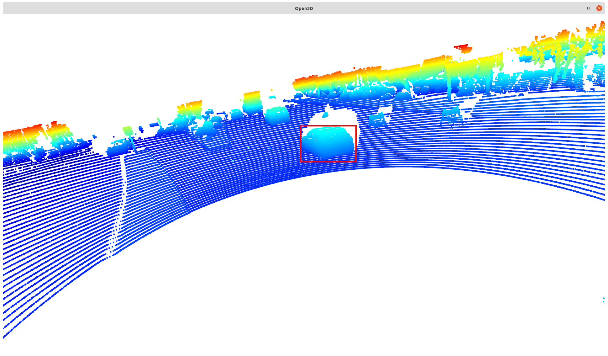
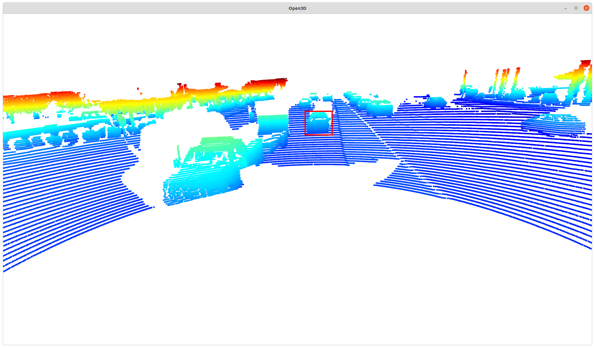
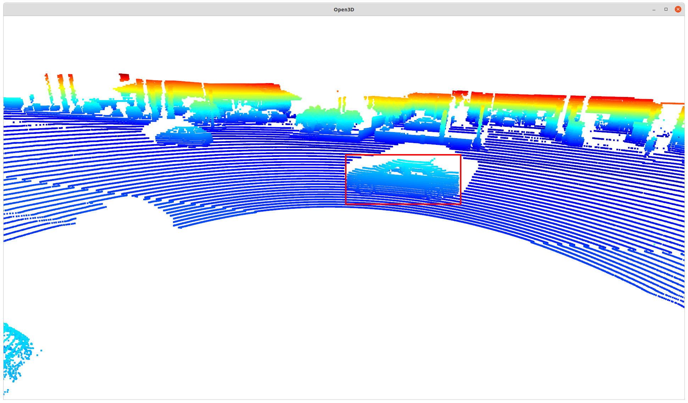
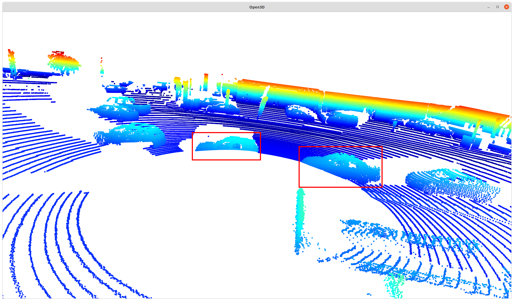
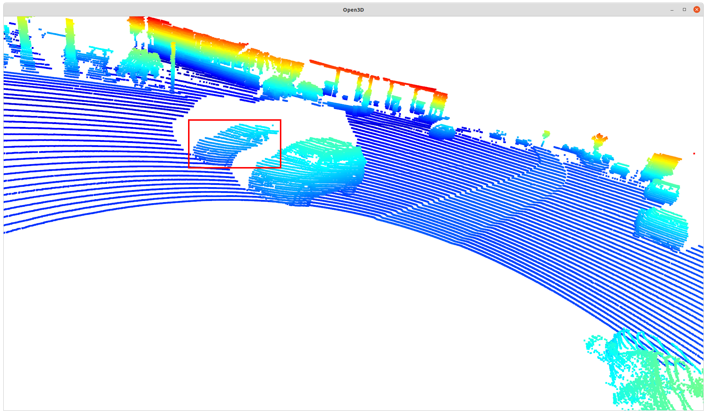
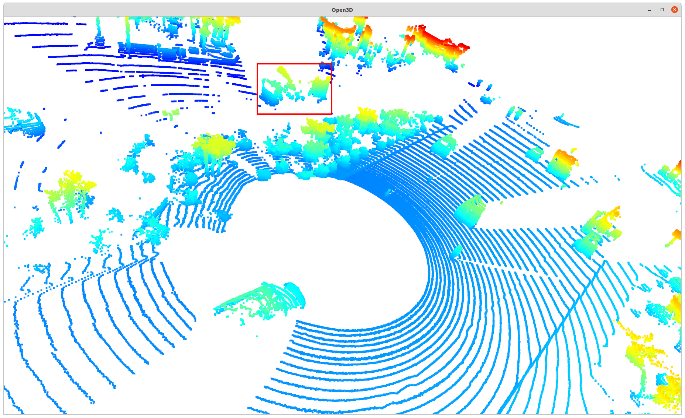
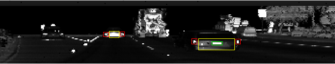
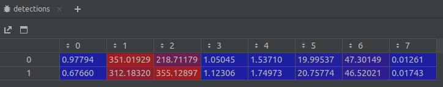
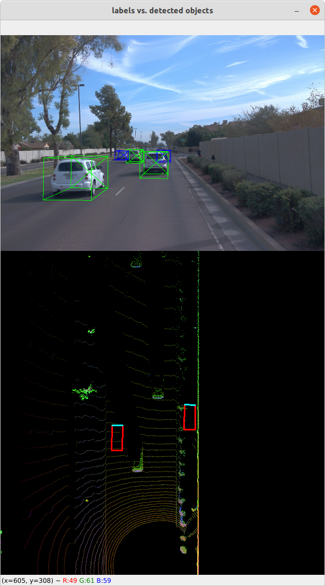

## Find and display 6 examples of vehicles with varying degrees of visibility in the point-cloud

#### rear view of car in front

#### front view of car behind

#### full side view

#### very close-by

#### occluded by another car 

#### truck behind trees

## Identify vehicle features that appear as a stable feature on most vehicles (e.g. rear-bumper, tail-lights) and describe them briefly. Also, use the range image viewer from the last example to underpin your findings using the lidar intensity channel.

Here are some stable features among vehicles:

#### front and rear-bumpers
These are mostly vertical surfaces that generate dense reflection on lidar images.

#### tail-lights
These are highly reflective surfaces that generate high intensity lidar reflection.

#### license plate
Similar to tail-lights, license plates are highly reflective and usually located at the center of the back surface of vehicles. 

#### wheels
There are round shapes on the bottom sides of vehicles.

#### mirrors
These are small parts protrude from the sides of vehicles. 

#### windshields
There are glass that don't reflect lidar light as much and look like empty holes in lidar point cloud.

#### side view shape
Vehicles usually have distinct shapes when seeing from the side.

### Features on range image

A few features are visible in the above range image.
- Red boxes are tail-lights.
- Yellow boxes are rear bumpers.
- Green boxes are license plates.

## Help needed

I seem to have a hard time to get ID_S3_EX2 right, specifically L241-247 in `objdet_detect.py`.

The output of ID_S3_EX1 is in line with the expected results.

But the BEV-to-vehicle tranformation seems to be off:

Please help point out what is wrong. Thanks.

