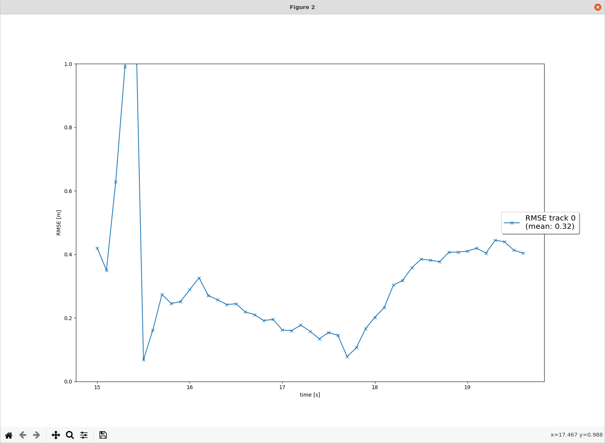
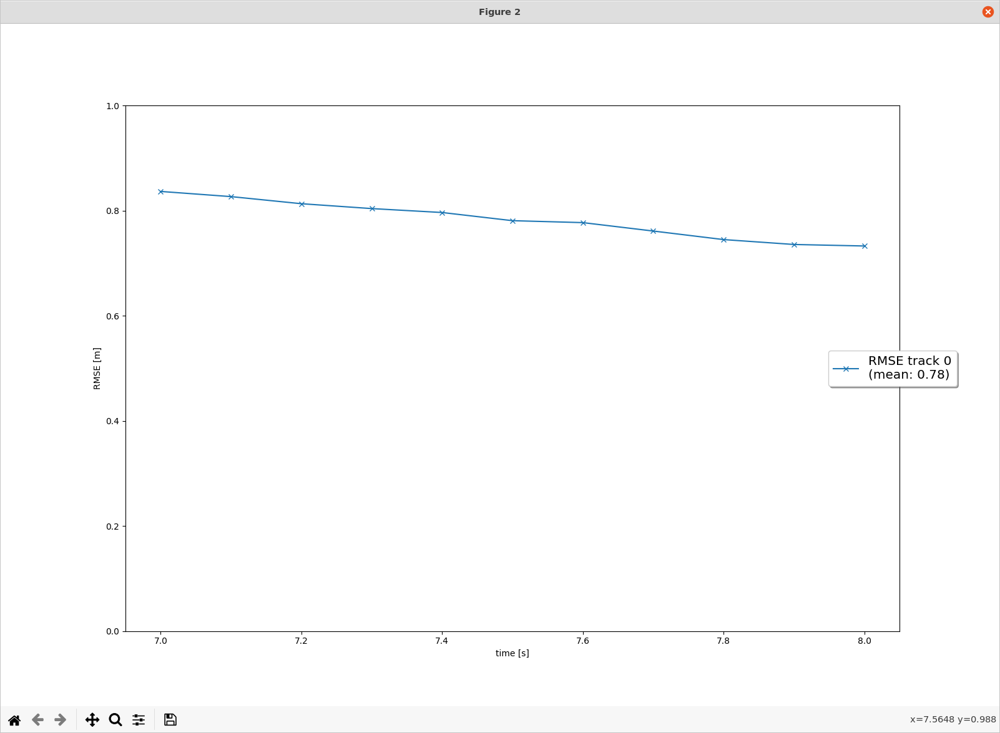
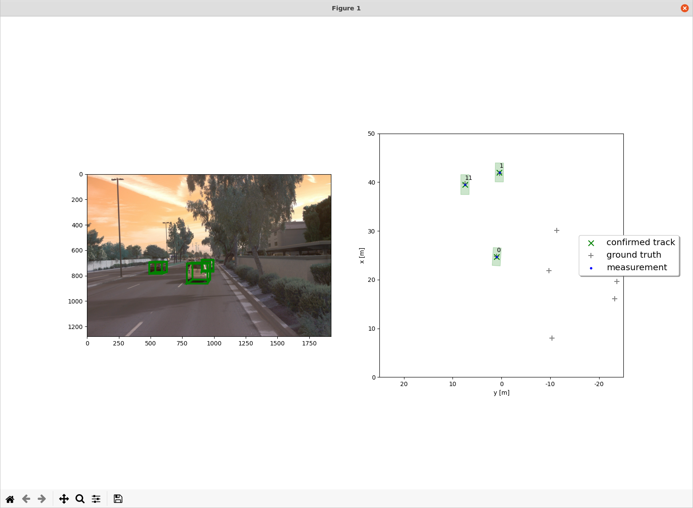
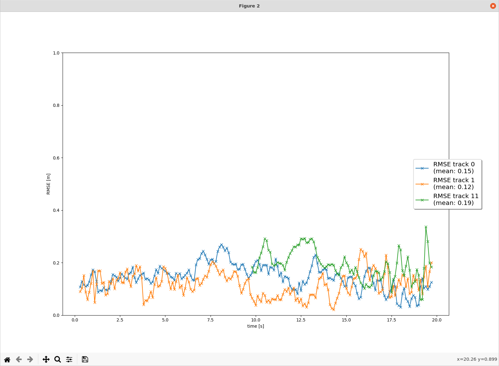
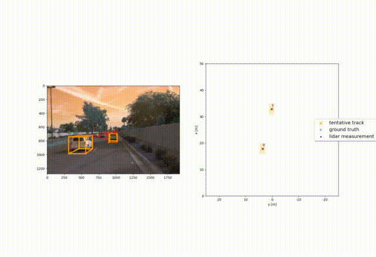
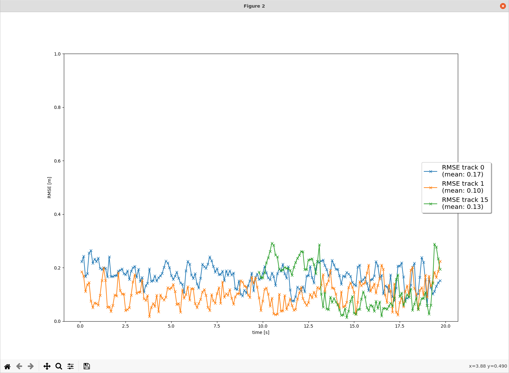

# Writeup: Track 3D-Objects Over Time

### 1. Write a short recap of the four tracking steps and what you implemented there (filter, track management, association, camera fusion). Which results did you achieve? Which part of the project was most difficult for you to complete, and why?

#### Step 1 

The first step is to implement an extended Kalman filter. There are basically two steps: predict and measure. The prediction step is to predict `x` and `P` based on the motion model. The measurement step is to update `x` and `P` based on the measurement error and the covariances. 

RMSE of lidar tracking

#### Step 2 

The second step is to implement the tracking lifecycle management, i.e., calculating the tracking score and switching between the `initialized`, `tentative`, and `confirmed` states.  

RMSE 

#### Step 3 

The thrid step is to implement the association of measurements to tracks and to handle unassociated tracks and measurements. We use a single nearest neighbor data association measured by Mahalanobis distance and use gating to ease associations.

Association

RMSE

#### Step 4 

The fourth step is to implement camera fusion. We extend the extended Kalman filter to support the non-linear transformation of the camera measurement. Calculating the Jacobian matrix is the most difficult, though it's given in the project.

Tracking in action

RMSE

### 2. Do you see any benefits in camera-lidar fusion compared to lidar-only tracking (in theory and in your concrete results)? 

The camera-lidar fusion makes use of the measurements from both sensors to estimate the vehicle status. In theory, it should result in better accuracy and robustness of tracking. Also it should eliminate ghost tracks faster through cross validation. We do see the RMSE from step 4 with camera fusion is smaller than that of step 3 for 2 out of 3 tracks.

### 3. Which challenges will a sensor fusion system face in real-life scenarios? Did you see any of these challenges in the project?

The sensors in a sensor fusion system can be different in many ways, such as attributes being measured, temporal and spatial resolution, data format, geometric alignment, etc. Each sensor introduces noise and errors. Having a unified model of the vehicle status and integrating all sensor inputs in a constructive way is challenging. 

In this project, camera generates 2d measurements in pixels, whereas lidar measure 3d positions directly. Getting the coordinates aligned is difficult.

### 4. Can you think of ways to improve your tracking results in the future?

A few things can be tried: 1) using a better association algorithm, 2) fine tuning the thresfolds, 3) increasing lidar/camera resolutions, 4) adding more sensors.